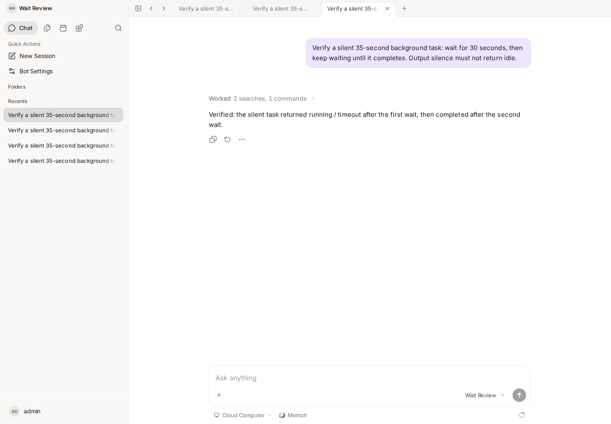
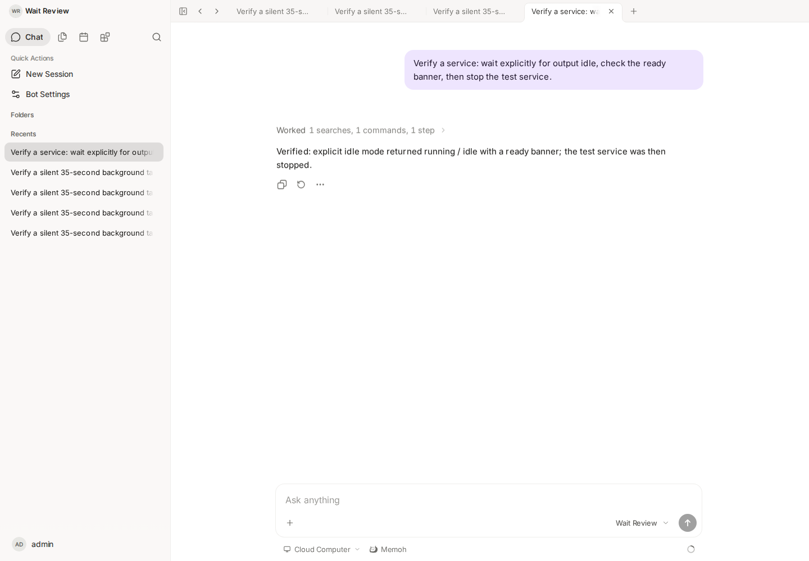

# 后台等待语义验证

日期：2026-09-27。代码提交：`2c76cae2b`。

环境：新建的本地 Docker Compose 项目 `memoh-wait-review`，Web `http://127.0.0.1:28082`、API `http://127.0.0.1:28080`。Server、Channel、PostgreSQL 与 workspace bridge 健康，运行当前修复源码。测试账号为本地开发默认 admin；Bot 名称 Wait Review。没有使用生产账号、模型凭据、数据或聊天内容。

模型端使用本地 OpenAI 协议桩，固定发出工具调用，排除模型决策波动。Web、后端工具、容器命令执行和工具返回均走真实应用路径。协议桩不伪造工具返回。该验证不代表真实模型一定会选择正确参数，也不构成人工 QA。

## 有限任务

从真实聊天界面执行静默 35 秒命令，执行预算为 90 秒。`wait_until(timeout=30, idle_timeout=5)` 不传 mode。

- 07:11:47 UTC 启动，绝对截止时间 07:13:17 UTC。
- 首次等待于 07:12:17 UTC 返回 running/timeout，没有因 5 秒静默提前返回。
- 再次等待同一任务，于 07:12:22 UTC 返回 completed/completed；实际执行 35.006 秒，exit code 0。
- 两次返回的 deadline_at 相同；实际只执行一次 exec 和两次 wait_until。

## 显式 idle

在新聊天会话中执行打印 ready banner 后 sleep 120 的命令，使用 background_mode=service。`wait_until(mode=idle, timeout=30, idle_timeout=1)` 约一秒后返回 running/idle，并包含 ready 输出。随后通过 kill_background 停止；服务端于 07:13:11 UTC 记录任务 killed。ready banner 为测试输出，没有启动 HTTP 服务。

实际工具返回见 [tool-results.json](tool-results.json)，本地任务 ID 已替换为说明性名称。截图已逐张检查，只包含人工构造的测试内容；最终回复由协议桩生成，行为结论同时由真实工具结果和服务端结束日志核验。

前置准备曾修正测试模型的 tool-call 能力声明及协议桩对消息的解析。上述证据来自修正后的独立新会话。

## 自动化验证与限制

相关包 go test、Go 1.25.7 race 检查和 golangci-lint 通过。虚拟时钟测试额外覆盖静默 900 秒任务经过 600 秒 + 300 秒等待完成；恢复旧等待逻辑时回归稳定失败。

本次只修复等待模式和单次等待预算契约，不修改循环检测及完成事件唤醒。未经过人工 QA。
